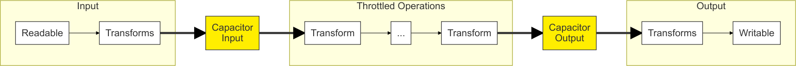

# stream-capacitor

[](https://www.npmjs.com/package/stream-capacitor) [](https://david-dm.org/timdp/stream-capacitor) [](https://circleci.com/gh/timdp/stream-capacitor) [](https://coveralls.io/r/timdp/stream-capacitor) [](https://standardjs.com/)

Throttles streams based on customizable throughput.

## Purpose

The idea is to throttle a sequence of operations (i.e., Node.js streams) based
on their throughput.

Where other implementations express their thresholds in bytes, this package
uses an abstract number of items. This makes it suitable for use with object
streams, where the raw payload size is either unknown or a less useful metric
than a simple counter.

When you create a stream capacitor, it gives you access to two ports: the input
port and the output port. When something flows through the input port, that
increments the capacitor's queue size. When something flows through the output
port, that decrements it again. Hence, you pipe the input port into the streams
you want to throttle, and you pipe those back into the output port.

Here is a visualization of a typical setup:



Note that the transforms in the input and output section are entirely optional.

## Usage

This snippet uses [pumpify](https://npmjs.com/package/pumpify) to easily
pipe a list of streams together. You can also use streams' native `.pipe()`
function if you prefer.

```js
import StreamCapacitor from 'stream-capacitor'
import pumpify from 'pumpify'

// When waiting for at least 10,000 items on the output side, pause input
const highWaterMark = 10000
// When the queue size drops below 3,000 again, resume input
const lowWaterMark = 3000
// Options are passed to the internal streams
const options = {objectMode: true}

// Create a new capacitor
const cap = new StreamCapacitor(highWaterMark, lowWaterMark, options)

// Put it all together
const flow = pumpify.obj(
  someReadable,         // Produce input
  inputTransform,       // Unthrottled input transform
  cap.input,            // Throttle every stream that follows
  transform1,           // Throttled transforms
  transform2,           // ...
  transform3,           // ...
  cap.output,           // End throttling
  outputTransform,      // Unthrottled output transform
  someWritable          // Consume output
)
```

## Events

A capacitor is an `EventEmitter` that can emit two events:

* `close` when throttling starts, and
* `open` when throttling stops.

## Custom Counting

By default, each item that flow through the input port will add one to the
queue size, and each item going through the output port will subtract one. If
you want to alter this behavior, you can use the `count` option. Its value is
a function that maps an item to the number of items it represents.

For example, to parse log lines into data objects and then batch them into
equally-sized arrays using [batch-stream](https://npmjs.com/package/batch-stream),
you could write something like:

```js
import StreamCapacitor from 'stream-capacitor'
import BatchStream from 'batch-stream'
import pumpify from 'pumpify'

const customCounter = (chunk, encoding) => {
  if (Array.isArray(chunk)) {
    // The output port receives arrays containing multiple items
    return chunk.length
  } else {
    // The input port receives one item at a time
    return 1
  }
}

const highWaterMark = 10000
const lowWaterMark = 3000
const options = {
  objectMode: true,
  count: customCounter  // See above
}
const cap = new StreamCapacitor(highWaterMark, lowWaterMark, options)
const flow = pumpify.obj(
  createLogLineReader(),
  cap.input,            // Adds one per log string
  createLogLineToDataObjectTransformer(),
  new BatchStream({size}),
  cap.output,           // Subtracts batch array length per batch
  createDataObjectWriter()
)
```

## Adding and Removing Items

A throttled transform may need to add or remove items. For example, you might
have a transform that transforms each input item into multiple output items,
or it might drop invalid input objects.

In this case, you can set the `delta` property on the capacitor to the number
of additional items that you're expecting on the output side. By default, it is
zero, meaning the capacitor expects one output item for each input item.

## Maintainer

[Tim De Pauw](https://github.com/timdp)

## License

MIT
